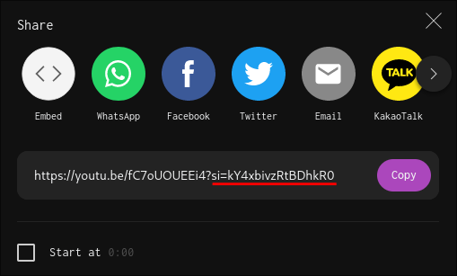
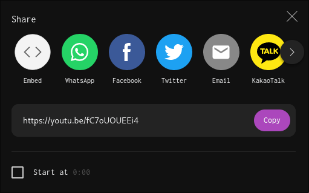

# YTShareAntiTrack
YouTube userscript to remove tracking parameters from share URLs

## Explanation

Recently, YouTube started adding a tracking parameter to their share URLs, when using the "share" button on a video. With this, they can track who is sharing videos with who, and under some circumstances even how they are shared.

This userscript removes any tracking parameters from this box, allowing you to safely copy the link without needing to manually modify it.

## Installation

First, you need a userscript manager. This script should work with any manager, but is only being tested on Violentmonkey.

> - [Violentmonkey for Chrome](https://chrome.google.com/webstore/detail/violentmonkey/jinjaccalgkegednnccohejagnlnfdag) 
> - [Violentmonkey for Firefox](https://addons.mozilla.org/firefox/addon/violentmonkey/) 
> - [Violentmonkey for Edge](https://microsoftedge.microsoft.com/addons/detail/eeagobfjdenkkddmbclomhiblgggliao) 
> - [Userscripts for Safari (MacOS/iOS/iPadOS)](https://apps.apple.com/us/app/userscripts/id1463298887) 

Once you have a manager, install YTShareAntiTrack by clicking [here](https://github.com/Xenorio/YTShareAntiTrack/raw/main/YTShareAntiTrack.user.js).
